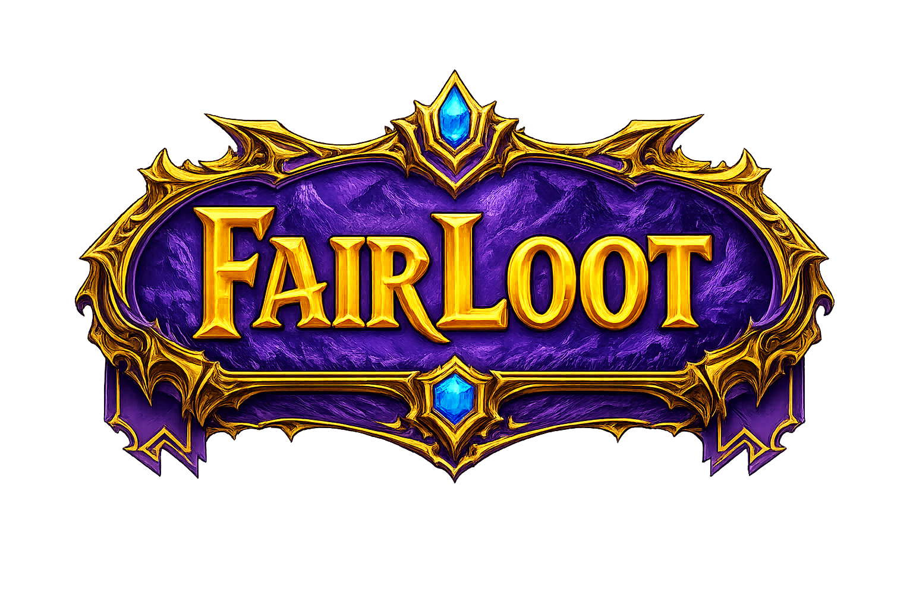

<p align="center">
  
</p>

<h3 align="center">Sistema de distribuição de loot justo para guilds de World of Warcraft</h3>

<p align="center">
  
  
  
  
  
</p>

---

## 📋 Índice

- [Visão Geral](#-visão-geral)
- [Funcionalidades](#-funcionalidades)
- [Arquitetura](#-arquitetura)
- [Algoritmo de Prioridade](#-algoritmo-de-prioridade)
- [Tech Stack](#-tech-stack)
- [Estrutura do Projeto](#-estrutura-do-projeto)
- [Pré-requisitos](#-pré-requisitos)
- [Instalação e Setup](#-instalação-e-setup)
- [Configuração](#-configuração)
- [Rodando o Projeto](#-rodando-o-projeto)
- [API Endpoints](#-api-endpoints)
- [Roles e Permissões](#-roles-e-permissões)
- [Integração WowAudit](#-integração-wowaudit)
- [Integração Blizzard API](#-integração-blizzard-api-opcional)
- [Banco de Dados](#-banco-de-dados)
- [Frontend](#-frontend)
- [Deploy](#-deploy)

---

## 🎯 Visão Geral

**FairLoot** é um sistema completo de loot council automatizado para guilds de World of Warcraft. Ele integra com a API do [WowAudit](https://wowaudit.com) para importar wishlists dos jogadores e utiliza um algoritmo de prioridade com três fatores configuráveis para sugerir distribuições justas de loot.

O sistema resolve o problema clássico de loot council: **como distribuir itens de forma justa, levando em conta o quanto o item é upgrade para cada jogador, quantos itens cada um já recebeu, e quão recentemente receberam loot.**

---

## ✨ Funcionalidades

### Para Admins (Loot Council)
- **Controle de Loot** — Seleção visual de dificuldade → raid → boss → itens com imagens das raids
- **Sugestões inteligentes** — Algoritmo de 3 fatores ranqueia candidatos por prioridade
- **Distribuição em lote** — Distribui múltiplos itens de uma vez, com detecção automática de transmog
- **Painel Admin** — Configura pesos do algoritmo (α, β, γ), gerencia WowAudit key, sincroniza personagens
- **Gestão de membros** — Aprova/rejeita pedidos de entrada, remove membros da guild
- **Desfazer distribuições** — Reverte qualquer distribuição do histórico

### Para Readers (Membros)
- **Histórico de Loot** — Visualiza todo o histórico de distribuições da guild
- **Wishlist** — Consulta as wishlists de todos os jogadores via WowAudit
- **Membros** — Visualiza os membros ativos da guild

### Geral
- **Multi-idioma** — Português (PT) e English (EN), alternável em tempo real
- **Tema claro/escuro** — Persistido no localStorage
- **Autenticação JWT** — Access token + Refresh token com HttpOnly cookie
- **Registro com aprovação** — Novos membros de guilds existentes precisam de aprovação do Admin
- **Sync automático** — Background service sincroniza personagens do WowAudit a cada 30 minutos

---

## 🏗 Arquitetura

```
┌─────────────────┐     HTTP/REST      ┌─────────────────────────────────┐
│                 │ ◄──────────────────► │          ASP.NET Core 8        │
│   React SPA     │                     │         (FairLoot API)         │
│   (Vite + TS)   │                     ├─────────────────────────────────┤
│   Port: 5173    │                     │  Controllers                   │
│                 │                     │  ├── AuthController            │
└─────────────────┘                     │  ├── LootController            │
                                        │  ├── GuildController           │
                                        │  └── GuildMemberController     │
                                        ├─────────────────────────────────┤
                                        │  Services                      │
                                        │  ├── TokenService (JWT)        │
                                        │  ├── WowAuditService           │
                                        │  ├── WowAuditSyncService (BG)  │
                                        │  └── BlizzardService           │
                                        ├─────────────────────────────────┤
                                        │  Data                          │
                                        │  └── AppDbContext (EF Core)    │
                                        └──────────┬──────────────────────┘
                                                   │
                                                   ▼
                                        ┌─────────────────────┐
                                        │   PostgreSQL (Neon)  │
                                        └─────────────────────┘
                                                   ▲
                             ┌─────────────────────┤
                             │                     │
                   ┌─────────┴──────┐    ┌─────────┴──────┐
                   │   WowAudit API │    │  Blizzard API  │
                   │  (wishlists,   │    │  (item icons)  │
                   │   characters)  │    │   [opcional]   │
                   └────────────────┘    └────────────────┘
```

---

## 🧮 Algoritmo de Prioridade

O FairLoot calcula a prioridade de cada candidato para cada item usando uma fórmula de três fatores com pesos configuráveis:

```
Priority = α × UpgradeNorm + β × FairnessNorm + γ × LootCountNorm
```

### Fatores

| Fator | Peso padrão | Descrição |
|-------|:-----------:|-----------|
| **α (Alpha) — Upgrade** | `0.4` | Quanto o item é upgrade para o jogador (% do WowAudit). Normalizado pelo maior valor entre todos os candidatos. **Maior % = maior prioridade.** |
| **β (Beta) — Score acumulado** | `0.3` | Soma de todos os itens que o jogador já recebeu (1 ponto por item). Invertido via min-max: **menor score = maior prioridade**, favorecendo quem recebeu menos loot. |
| **γ (Gamma) — Loot recente** | `0.3` | Quantidade de itens recebidos nos últimos 30 dias. Invertido: **menos itens recentes = maior prioridade**, evitando que alguém receba muitos itens seguidos. |

### Desempate

Quando dois jogadores têm a mesma prioridade:
1. Maior % de upgrade ganha
2. Menor score acumulado ganha
3. Quem recebeu loot há mais tempo ganha

### Transmog

Quando nenhum candidato tem upgrade (todos com 0%), ou quando há mais cópias do item do que candidatos com upgrade, as cópias excedentes são marcadas como **TRANSMOG** e não são atribuídas a ninguém.

### Configuração dos pesos

Os pesos α, β e γ são configuráveis por guild no painel Admin. A soma não precisa ser exatamente 1, mas é recomendado:
- `0.5 / 0.25 / 0.25` — prioriza upgrade
- `0.33 / 0.33 / 0.33` — equilibra tudo
- `0.2 / 0.4 / 0.4` — prioriza justiça na distribuição

---

## 🛠 Tech Stack

### Backend
| Tecnologia | Uso |
|------------|-----|
| **ASP.NET Core 8** | Web API REST |
| **Entity Framework Core 8** | ORM com PostgreSQL |
| **Npgsql** | Provider PostgreSQL para EF Core |
| **JWT Bearer** | Autenticação com access + refresh tokens |
| **ASP.NET Identity** | Password hashing (PasswordHasher) |
| **Swagger / Swashbuckle** | Documentação da API (dev) |
| **BackgroundService** | Sync automático de personagens |

### Frontend
| Tecnologia | Uso |
|------------|-----|
| **React 18** | UI library |
| **TypeScript 5.5** | Type safety |
| **Vite 5** | Build tool e dev server |
| **React Router DOM 6** | Roteamento SPA |
| **Axios** | HTTP client |
| **SCSS** | Estilos com variáveis e temas |

### Infra
| Tecnologia | Uso |
|------------|-----|
| **PostgreSQL (NeonDB)** | Banco de dados serverless |
| **WowAudit API** | Wishlists e personagens da guild |
| **Blizzard API** | Ícones de itens (opcional) |

---

## 📁 Estrutura do Projeto

```
FairLoot/
├── FairLoot/                    # Backend ASP.NET Core
│   ├── Controllers/
│   │   ├── AuthController.cs        # Register, Login, Refresh, Logout, Me, CheckGuild
│   │   ├── LootController.cs        # Suggest, Distribute, History, Undo
│   │   ├── GuildController.cs       # CRUD guild, sync chars, wishlists
│   │   ├── GuildMemberController.cs # CRUD membros, approve, delete
│   │   └── BaseApiController.cs     # Helpers de autenticação compartilhados
│   ├── Domain/
│   │   ├── Guild.cs                 # Guild entity (nome, server, pesos α/β/γ)
│   │   ├── User.cs                  # User entity (email, role, isApproved)
│   │   ├── Character.cs             # Character entity (nome, classe, score)
│   │   ├── LootDrop.cs              # Registro de distribuição de loot
│   │   ├── RefreshToken.cs          # Refresh token entity
│   │   ├── WishlistCache.cs         # Cache de wishlists do WowAudit
│   │   └── UserRoles.cs             # Constantes: Admin, Reader
│   ├── DTOs/
│   │   ├── LootDto.cs               # SuggestItem, SuggestionCandidate, Distribution
│   │   ├── GuildDto.cs              # GuildUpdateDto
│   │   ├── UserDto.cs               # UserDto, CreateMemberRequest
│   │   ├── RegisterRequest.cs       # RegisterRequest
│   │   └── WowAuditDtos.cs          # DTOs do WowAudit (wishlists, encounters)
│   ├── Services/
│   │   ├── WowAuditService.cs       # Integração WowAudit (wishlists, chars, icons)
│   │   ├── WowAuditSyncService.cs   # Background sync a cada 30 min
│   │   ├── BlizzardService.cs       # Integração Blizzard API (ícones de itens)
│   │   └── TokenService.cs          # Geração de JWT access + refresh tokens
│   ├── Data/
│   │   └── AppDbContext.cs          # EF Core DbContext
│   ├── Migrations/                  # EF Core migrations
│   ├── Program.cs                   # Startup, DI, middleware
│   ├── appsettings.json             # Config (connection string, JWT) — NÃO versionado
│   ├── appsettings.Template.json    # Template sem credenciais (versionado)
│   └── FairLoot.csproj              # .NET 8 project file
│
├── client/                      # Frontend React
│   ├── src/
│   │   ├── pages/
│   │   │   ├── Home.tsx             # Landing page (login + register inline)
│   │   │   ├── Control.tsx          # Shell com tabs (role-aware)
│   │   │   ├── Loot.tsx             # Controle de loot (step 1: seleção, step 2: sugestões)
│   │   │   ├── Members.tsx          # Grid de membros com approve/remove
│   │   │   ├── Wishlist.tsx         # Visualização de wishlists WowAudit
│   │   │   ├── LootHistory.tsx      # Histórico com undo
│   │   │   └── AdminPanel.tsx       # Configurações e pesos do algoritmo
│   │   ├── context/
│   │   │   └── AppContext.tsx       # Theme, Language, Translations (PT/EN)
│   │   ├── services/
│   │   │   ├── api.ts               # Axios instance com interceptors
│   │   │   └── auth.ts              # login(), register(), logout()
│   │   ├── components/
│   │   │   └── ProtectedRoute.tsx   # Route guard para rotas autenticadas
│   │   ├── styles/
│   │   │   ├── _variables.scss      # Cores e constantes
│   │   │   ├── _layout.scss         # Layout, tema claro/escuro, responsivo
│   │   │   ├── _forms.scss          # Estilos de formulário
│   │   │   └── _sidebar.scss        # Sidebar styles
│   │   ├── assets/
│   │   │   ├── logo.png             # Logo FairLoot
│   │   │   ├── gold_one.png         # Imagem lateral esquerda (tesouro)
│   │   │   ├── gold_two.png         # Imagem lateral direita (tesouro)
│   │   │   ├── voidspire.jpg        # Imagem raid The Voidspire
│   │   │   ├── dreamrift.jpg        # Imagem raid The Dreamrift
│   │   │   └── marchonqueldanas.jpg # Imagem raid March on Quel'Danas
│   │   ├── main.tsx                 # Entry point, rotas
│   │   ├── index.scss               # Global styles
│   │   └── assets.d.ts              # Type declarations para assets
│   ├── package.json
│   ├── tsconfig.json
│   └── vite.config.mjs
│
├── package.json                 # Monorepo scripts (dev concurrently)
├── .gitignore                   # Exclui bin/, obj/, node_modules/, appsettings.json
└── README.md
```

---

## 📦 Pré-requisitos

- [.NET 8 SDK](https://dotnet.microsoft.com/download/dotnet/8.0)
- [Node.js 18+](https://nodejs.org/) com npm
- [PostgreSQL](https://www.postgresql.org/) (ou uma instância [NeonDB](https://neon.tech/))
- Uma conta no [WowAudit](https://wowaudit.com) com API key da guild
- (Opcional) Credenciais da [Blizzard API](https://develop.battle.net/) para ícones de itens

---

## 🚀 Instalação e Setup

### 1. Clone o repositório

```bash
git clone https://github.com/seu-usuario/FairLoot.git
cd FairLoot
```

### 2. Instale as dependências do frontend

```bash
cd client
npm install
cd ..
```

### 3. Instale as dependências do monorepo (opcional, para `npm run dev`)

```bash
npm install
```

### 4. Restaure os pacotes .NET

```bash
dotnet restore FairLoot/FairLoot.csproj
```

### 5. Configure o banco de dados

Copie o template de configuração e preencha com suas credenciais:

```bash
cp FairLoot/appsettings.Template.json FairLoot/appsettings.json
```

Edite `FairLoot/appsettings.json` com sua connection string do PostgreSQL:

> ⚠️ O arquivo `appsettings.json` está no `.gitignore` e **não é versionado**. Apenas o `appsettings.Template.json` (sem credenciais) vai para o repositório.

```json
{
  "ConnectionStrings": {
    "DefaultConnection": "Host=seu-host; Database=fairloot; Username=seu-user; Password=sua-senha; SSL Mode=VerifyFull;"
  },
  "Jwt": {
    "Key": "SUA_CHAVE_SECRETA_COM_PELO_MENOS_32_CARACTERES",
    "Issuer": "FairLoot",
    "Audience": "FairLootUsers"
  }
}
```

### 6. Aplique as migrations

```bash
cd FairLoot
dotnet ef database update
```

---

## ⚙ Configuração

### Variáveis de ambiente / appsettings.json

| Chave | Obrigatório | Descrição |
|-------|:-----------:|-----------|
| `ConnectionStrings:DefaultConnection` | ✅ | Connection string PostgreSQL |
| `Jwt:Key` | ✅ | Chave secreta para assinar JWTs (mín. 32 chars) |
| `Jwt:Issuer` | ✅ | Issuer do JWT (ex: `FairLoot`) |
| `Jwt:Audience` | ✅ | Audience do JWT (ex: `FairLootUsers`) |
| `Blizzard:ClientId` | ❌ | Client ID da Blizzard API (para ícones) |
| `Blizzard:ClientSecret` | ❌ | Client Secret da Blizzard API |

### WowAudit API Key

A chave do WowAudit é configurada **por guild**, não no appsettings. É inserida:
- No registro (quando cria uma nova guild)
- No painel Admin (para alterar depois)

---

## ▶ Rodando o Projeto

### Modo desenvolvimento (monorepo)

```bash
npm run dev
```

Isso roda simultaneamente:
- **Backend** em `https://localhost:5001` (ou `http://localhost:5000`)
- **Frontend** em `http://localhost:5173`

### Modo separado

**Terminal 1 — Backend:**
```bash
cd FairLoot
dotnet watch
```

**Terminal 2 — Frontend:**
```bash
cd client
npm run dev
```

### Swagger

Em modo desenvolvimento, a documentação da API está disponível em:
```
https://localhost:5001/swagger
```

---

## 📡 API Endpoints

### Auth (`/api/auth`)

| Método | Rota | Auth | Descrição |
|--------|------|:----:|-----------|
| `POST` | `/register` | ❌ | Registra guild + admin, ou reader em guild existente |
| `POST` | `/login` | ❌ | Login com email/senha → retorna JWT |
| `POST` | `/refresh` | ❌ | Renova access token via refresh token |
| `POST` | `/revoke` | ✅ | Revoga um refresh token específico |
| `POST` | `/logout` | ✅ | Revoga todos os refresh tokens do usuário |
| `GET` | `/me` | ✅ | Retorna dados do usuário autenticado |
| `GET` | `/check-guild?name=X&server=Y` | ❌ | Verifica se uma guild já existe |

### Loot (`/api/loot`)

| Método | Rota | Auth | Descrição |
|--------|------|:----:|-----------|
| `GET` | `/history` | ✅ | Lista todo o histórico de loot da guild |
| `POST` | `/suggest` | ✅ | Calcula sugestões de distribuição para itens |
| `POST` | `/distribute` | ✅ | Confirma a distribuição de itens |
| `POST` | `/undo/{id}` | ✅ | Reverte uma distribuição e restaura scores |

### Guild (`/api/guild`)

| Método | Rota | Auth | Descrição |
|--------|------|:----:|-----------|
| `GET` | `/` | ✅ | Retorna dados da guild do usuário |
| `PUT` | `/` | ✅ Admin | Atualiza guild (nome, server, key, pesos) |
| `DELETE` | `/` | ✅ Admin | Deleta a guild |
| `GET` | `/characters` | ✅ | Lista personagens da guild (DB) |
| `POST` | `/sync-characters` | ✅ | Força sync de personagens do WowAudit |
| `GET` | `/wowaudit/characters` | ✅ | Lista personagens direto do WowAudit |
| `GET` | `/wowaudit/wishlists` | ✅ | Retorna wishlists com summary por personagem |
| `GET` | `/members/pending` | ✅ Admin | Lista membros pendentes de aprovação |
| `POST` | `/members/{id}/approve` | ✅ Admin | Aprova um membro pendente |

### Guild Members (`/api/guildmember`)

| Método | Rota | Auth | Descrição |
|--------|------|:----:|-----------|
| `GET` | `/` | ✅ | Lista todos os membros da guild |
| `POST` | `/` | ✅ Admin | Adiciona um novo membro |
| `PUT` | `/{id}` | ✅ Admin | Atualiza role/email de um membro |
| `DELETE` | `/{id}` | ✅ Admin | Remove um membro da guild |

---

## 🔐 Roles e Permissões

| Funcionalidade | Admin | Reader |
|----------------|:-----:|:------:|
| Controle de Loot (suggest/distribute) | ✅ | ❌ |
| Histórico de Loot | ✅ | ✅ |
| Desfazer distribuição | ✅ | ✅ |
| Ver membros | ✅ | ✅ |
| Aprovar/remover membros | ✅ | ❌ |
| Wishlist (WowAudit) | ✅ | ✅ |
| Painel Admin (config) | ✅ | ❌ |
| Sincronizar personagens | ✅ | ❌ |

### Fluxo de registro

1. **Nova guild** → Usuário vira `Admin`, automaticamente aprovado, recebe JWT
2. **Guild existente** → Usuário vira `Reader`, `IsApproved = false`, precisa de aprovação
3. O frontend detecta guilds existentes em tempo real e mostra aviso ao usuário

---

## 🔗 Integração WowAudit

O FairLoot consome a API do WowAudit para:

1. **Wishlists** — Importa a wishlist de cada jogador com % de upgrade por item, por boss, por dificuldade
2. **Personagens** — Sincroniza a lista de personagens da guild (nome, realm, classe)
3. **Sync automático** — Um `BackgroundService` roda a cada 30 minutos sincronizando personagens de todas as guilds

### Cache

- Wishlists são cacheadas por 5 minutos em memória para evitar requests excessivos
- Ícones de itens (Wowhead) são cacheados permanentemente por item ID
- Ícones não encontrados têm cache de 30 minutos antes de tentar novamente

---

## 🎮 Integração Blizzard API (Opcional)

Se configurada (`Blizzard:ClientId` e `Blizzard:ClientSecret`), a Blizzard API é usada para:

- Obter ícones oficiais de itens via Item Media endpoint
- Fallback: se a Blizzard API não estiver configurada, o sistema tenta scraping do Wowhead

---

## 🗄 Banco de Dados

### Entidades

```
Guild (1) ──── (*) User
  │                 │
  │                 └── (*) RefreshToken
  │
  ├── (*) Character
  │
  ├── (*) LootDrop
  │
  └── (1) WishlistCache
```

| Tabela | Campos principais |
|--------|-------------------|
| **Guilds** | Id, Name, Server, WowauditApiKey, PriorityAlpha/Beta/Gamma |
| **Users** | Id, Email, PasswordHash, GuildId, Role, IsApproved, CharacterName |
| **Characters** | Id, Name, Realm, Class, Score, IsActive, GuildId |
| **LootDrops** | Id, GuildId, Boss, Difficulty, ItemId, ItemName, AssignedTo, AwardValue |
| **RefreshTokens** | Id, Token, Expires, RevokedAt, ReplacedByToken, UserId |
| **WishlistCaches** | Id, GuildId, DataJson, UpdatedAt |

### Score dos personagens

- Cada item distribuído adiciona `1.0` ao score do personagem
- Itens marcados como transmog (sem candidato com upgrade) não somam score
- O score é usado no fator β do algoritmo de prioridade
- Desfazer uma distribuição subtrai o valor do score

---

## 🎨 Frontend

### Temas

O sistema suporta tema **escuro** (padrão) e **claro**, alternável via botão ☀️/🌙. Ambos os temas compartilham a estética fantasy/roxa que combina com o logo e as imagens de tesouro. As variáveis CSS são definidas em `_layout.scss`:

- `--bg`, `--card`, `--text`, `--muted`, `--accent`
- `--surface`, `--border`, `--input-bg`
- Cores especiais: `--color-transmog`, `--color-heroic`, `--color-mythic`

### Traduções

Todas as strings são traduzidas via `AppContext.tsx`. O idioma é persistido no `localStorage` e alternável via botão PT/EN.

### Páginas

| Rota | Componente | Descrição |
|------|------------|-----------|
| `/` | `Home` | Landing page com login/register inline + imagens laterais |
| `/control/loot` | `Loot` | Controle de loot (Admin only) |
| `/control/members` | `Members` | Grid de membros da guild |
| `/control/wishlist` | `Wishlist` | Wishlists do WowAudit |
| `/control/history` | `LootHistory` | Histórico de distribuições |
| `/control/admin` | `AdminPanel` | Config da guild (Admin only) |

---

## 🌐 Deploy

### Arquitetura de produção

```
Vercel (frontend React)
        │
        │ HTTPS
        ▼
Render (ASP.NET Core API)
        │
        ▼
Neon PostgreSQL
```

### Backend — Render

1. Crie um **Web Service** no [Render](https://render.com)
2. Aponte para o repositório GitHub
3. Configure:
   - **Build Command:** `dotnet publish FairLoot/FairLoot.csproj -c Release -o out`
   - **Start Command:** `dotnet out/FairLoot.dll`
   - **Environment:** `.NET`

4. Adicione as **Environment Variables** no dashboard do Render:

| Variável | Valor | Descrição |
|----------|-------|-----------|
| `ASPNETCORE_ENVIRONMENT` | `Production` | Modo produção |
| `ConnectionStrings__DefaultConnection` | `Host=...;Database=...;Password=...;SSL Mode=VerifyFull;` | Connection string do Neon PostgreSQL |
| `Jwt__Key` | *(chave de 64+ caracteres)* | Gere com `openssl rand -base64 64` |
| `Jwt__Issuer` | `FairLoot` | Issuer do JWT |
| `Jwt__Audience` | `FairLootUsers` | Audience do JWT |
| `CORS_ORIGINS` | `https://seu-app.vercel.app` | URL do frontend na Vercel |

> ⚠️ No Render, variáveis aninhadas usam `__` (dois underscores) em vez de `:`. Exemplo: `Jwt:Key` → `Jwt__Key`

### Frontend — Vercel

1. Crie um projeto no [Vercel](https://vercel.com) apontando para a pasta `client/`
2. Configure:
   - **Framework Preset:** Vite
   - **Root Directory:** `client`
   - **Build Command:** `npm run build`
   - **Output Directory:** `dist`

3. Adicione a **Environment Variable**:

| Variável | Valor |
|----------|-------|
| `VITE_API_URL` | `https://seu-app.onrender.com` *(URL do Render)* |

### Gerando uma JWT Key forte

```bash
# Linux / macOS / Git Bash
openssl rand -base64 64

# PowerShell
[Convert]::ToBase64String((1..64 | ForEach-Object { Get-Random -Max 256 }) -as [byte[]])
```

### Variáveis de ambiente — resumo

| Onde | Variável | Exemplo |
|------|----------|---------|
| **Render** | `ConnectionStrings__DefaultConnection` | `Host=ep-xxx.neon.tech; Database=neondb; ...` |
| **Render** | `Jwt__Key` | `k8Xp2mQ9vL4nR7wJ3bF6yH0t...` (64+ chars) |
| **Render** | `CORS_ORIGINS` | `https://fairloot.vercel.app` |
| **Vercel** | `VITE_API_URL` | `https://fairloot.onrender.com` |

---

## 📄 Licença

Este projeto é open-source. Sinta-se livre para usar, modificar e contribuir.

---

<p align="center">
  Feito com ⚔️ para a comunidade WoW
</p>
